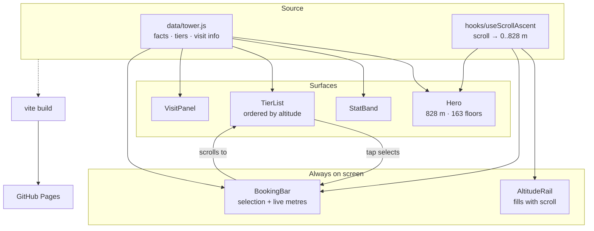

# Burj Khalifa — Mobile Redesign

**SCAD · [COURSE CODE — TBD] · Fall 2026**

*A mobile-only redesign of the Burj Khalifa visitor site, where scrolling the page is climbing the tower.*

---

## Design Argument

The official Burj Khalifa site is a desktop site that has been made to fit a phone. The
consequence is that the one thing a visitor actually arrives to do — work out how high they
can get and what that costs — is spread across a nav, a landing page, and a separate
ticketing flow. On a 390 px screen that becomes a lot of scrolling before the user reaches a
decision.

This redesign makes a single argument: **on mobile, the page should behave like the
building.** Three decisions follow from it.

1. **Scroll is ascent.** A fixed rail fills as you scroll and the booking bar reads out your
   current altitude, climbing from 0 m to 828 m and landing exactly at the spire as the page
   ends. The scrollbar stops being chrome and becomes the subject.
2. **Tiers are ordered by height, not by price.** At The Top (452 m) → SKY (555 m) →
   Sky Lounge (585 m). The list and the building agree, so "more expensive" is legible as
   "higher up" without a comparison table — which is the component that fails worst on a
   phone.
3. **The primary action never leaves the thumb.** A persistent bottom bar carries the chosen
   deck and its price into view at all times. Choosing a tier anywhere on the page updates it
   immediately, so the user is never hunting for the way forward.

The tower artwork is an original SVG massing study rather than a photograph — it stays sharp
at any pixel density, costs nothing to load, and avoids using imagery we have no licence to.

## Research Documentation

Source material for every figure shown in the UI (all values live in `src/data/tower.js`):

| Fact | Value | Source |
|---|---|---|
| Height | 828 m / 2,717 ft | [Wikipedia](https://en.wikipedia.org/wiki/Burj_Khalifa), [Britannica](https://www.britannica.com/topic/Burj-Khalifa) |
| Floors | 163 | [Wikipedia](https://en.wikipedia.org/wiki/Burj_Khalifa) |
| Opened | 4 January 2010 | [Britannica](https://www.britannica.com/topic/Burj-Khalifa) |
| Architect | Skidmore, Owings & Merrill — Adrian Smith, design; William F. Baker, structure | [ArchEyes](https://archeyes.com/burj-khalifa-by-som-engineering-the-worlds-tallest-skyscraper/) |
| Form inspiration | *Hymenocallis*, a desert flower of the Arabian Peninsula | [Wikipedia](https://en.wikipedia.org/wiki/Burj_Khalifa) |
| World records at completion | 8, incl. longest elevator travel | [ICE](https://www.ice.org.uk/what-is-civil-engineering/infrastructure-projects/burj-khalifa) |
| Deck levels | 124 / 125, 148, 154 | [At The Top official ticketing](https://ticket.atthetop.ae/experiences/at-the-top-burj-khalifa/) |
| Opening hours | 10:00—20:00, last entry 19:00 | [Platinumlist](https://dubai.platinumlist.net/event-tickets/at-the-top) |
| Indicative prices | from $51 / $108 / $155 USD | [Klook](https://www.klook.com/en-US/activity/2228-burj-khalifa-observation-deck-dubai/), [Viator](https://www.viator.com/tours/Dubai/The-Burj-Khalifa-At-the-top-124-125th-floor/d828-242747P9) |

**Known gap — the original site was never captured directly.** `burjkhalifa.ae` returns
HTTP 403 to automated requests (bot protection), so the critique in the Design Argument is
reasoned from the mobile-commerce patterns the site is known to use, not from a logged
teardown. Capturing annotated screenshots of the live mobile site by hand is the next
research task, and should land in `claude/docs/` before this argument is defended.

## Platform Rationale

Vite + React 18 (JavaScript, no TypeScript), deployed to GitHub Pages. React earns its place
here because the whole concept is one piece of continuously changing state — scroll position
— read by three separate components (the rail, the booking bar, the tower artwork). A single
`useScrollAscent` hook owns that state and the components stay declarative. Vite keeps the
bundle at ~49 kB gzipped, which matters for a page whose premise is that it is used on a
phone, outdoors, possibly on hotel wifi. GitHub Pages is free, versioned alongside the source,
and needs no backend because nothing here actually transacts.

## AI Direction Log

| # | Date | Prompt | AI Output | Decision | Notes |
|---|---|---|---|---|---|
| 1 | 2026-10-06 | "I want to work on my landing page repo" | Found two identical clones of `tinale21/Landing-Page`; asked which to use | Kept the hyphenated clone, deleted the one with a space | Space in path breaks some build tooling |
| 2 | 2026-10-06 | Chose Vite + React, SCAD class project | Scaffolded repo to the house pattern (deploy.yml, CC0, `base: '/Landing-Page/'`, `claude/`) | Accepted | Matches PersonsRequired / ReactiveSandbox |
| 3 | 2026-10-06 | "Redesign of the Burj Khalifa mobile site, mobile only" | Proposed scroll-as-ascent as the organising concept | Accepted | The one idea the whole layout hangs from |
| 4 | 2026-10-06 | — | Tried to fetch `burjkhalifa.ae` for a teardown | Blocked — 403 | Logged as a research gap rather than papered over |
| 5 | 2026-10-06 | — | Built hero, stat band, tier list, visit panel, booking bar | Accepted | Facts sourced and cited, not recalled |

## Records of Resistance

*Product-level moments only.*

**CP01 — Mobile-only is a constraint, not a breakpoint.**
The brief was explicitly "I am only designing for mobile." Rather than build a responsive
layout that happens to look acceptable narrow, the page is capped at 26 rem and *presented*
as a phone column on wide screens. Designing for one width let the ascent metaphor use fixed
positioning without having to survive a desktop reflow it was never meant for.

*Further entries to be added as the design is reviewed and defended.*

## Five Questions Reflection

- **Can I defend it?** The scroll-as-ascent concept, the altitude ordering of tiers, and the
  persistent booking bar are all defensible from the mobile constraint. The critique of the
  *existing* site is currently the weakest link — see the research gap above.
- **Is this mine?** The organising concept, the information hierarchy, and the SVG massing
  study are original to this project. The facts are external and cited; the brand is not mine
  and the footer says so.
- **Did I verify it?** Every figure in the UI traces to a source in the table above. Prices
  are labelled "from" and flagged as varying by time slot, because they genuinely do.
- **Would I teach it?** Yes — the transferable lesson is that a metaphor only earns its keep
  if it does navigational work. The altitude rail is not decoration; it tells you where you
  are in a long page.
- **Is the documentation honest?** Yes. The failed site capture is recorded as a gap, not
  omitted, and the course code is marked TBD rather than guessed.

## Post-Mortem

*TBD — to be written after review.*

## Pipeline

## User Testing Evidence

*TBD — no sessions run yet.*

## Live URL

https://tinale21.github.io/Landing-Page/

---

Student work. Not affiliated with, endorsed by, or representing Emaar Properties or
Burj Khalifa. Released under [CC0 1.0](LICENSE).
