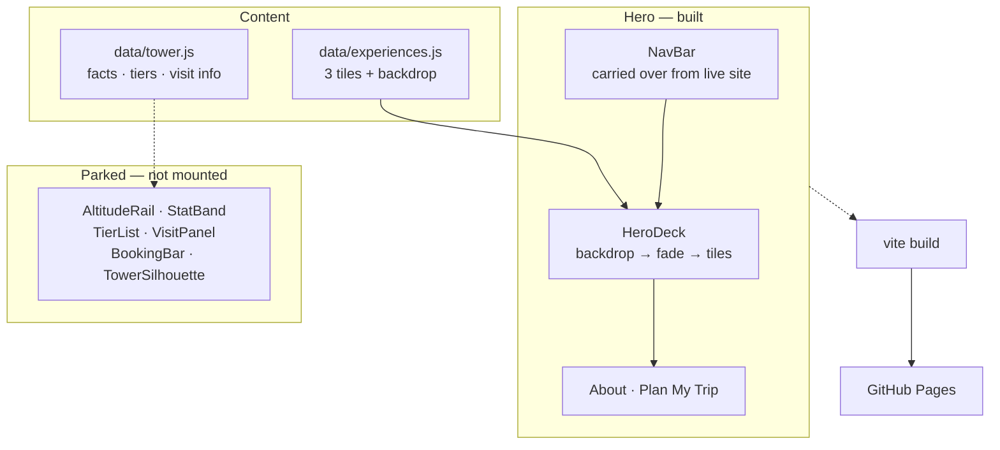

# Burj Khalifa — Mobile Redesign

**SCAD · [COURSE CODE — TBD] · Fall 2026**

*A mobile-only redesign of the Burj Khalifa visitor site, where scrolling the page is climbing the tower.*

---

## Design Argument

The official Burj Khalifa site is a desktop site made to fit a phone. The consequence is that
a visitor arrives wanting to know *what they can do here* and instead meets a nav, a landing
page, and a separate ticketing flow. On a 390 px screen that is a lot of scrolling before
reaching a decision.

This redesign answers with an **experience-led hero**. Three decisions follow.

1. **Lead with the view, not the building.** A full-bleed photograph from the observation
   deck fades into white, so the page opens on what a visitor actually comes for. The fade —
   rather than a hard crop — lets the image hand off to type without a visible seam.
2. **Surface the three experiences immediately.** Fine Dining, Luxury Stays, and Wellness sit
   as tappable tiles over the fade, with the middle tile forward and larger. The tower is not
   only an observation deck, and the hero says so before the user scrolls once.
3. **Two exits, clearly ranked.** *About Burj Khalifa* is filled and *Plan My Trip* is
   outlined, so the browsing path and the booking path are both one tap away without
   competing for the same emphasis.

The top navigation is carried over unchanged from the current mobile site — logo, language
switcher, `BOOK TICKETS`, hamburger — because it already works on a phone and changing it
would spend the user's familiarity for nothing. The tiles are not an invented taxonomy
either: they are three of the site's own five EXPERIENCES categories, promoted from two taps
deep inside the hamburger onto the first screen.

## Research Documentation

Source material for every figure shown in the UI (all values live in `src/data/tower.js`):

| Fact | Value | Source |
|---|---|---|
| Height | 828 m / 2,717 ft | [Wikipedia](https://en.wikipedia.org/wiki/Burj_Khalifa), [Britannica](https://www.britannica.com/topic/Burj-Khalifa) |
| Floors | 163 | [Wikipedia](https://en.wikipedia.org/wiki/Burj_Khalifa) |
| Opened | 4 January 2010 | [Britannica](https://www.britannica.com/topic/Burj-Khalifa) |
| Architect | Skidmore, Owings & Merrill — Adrian Smith, design; William F. Baker, structure | [ArchEyes](https://archeyes.com/burj-khalifa-by-som-engineering-the-worlds-tallest-skyscraper/) |
| Form inspiration | *Hymenocallis*, a desert flower of the Arabian Peninsula | [Wikipedia](https://en.wikipedia.org/wiki/Burj_Khalifa) |
| World records at completion | 8, incl. longest elevator travel | [ICE](https://www.ice.org.uk/what-is-civil-engineering/infrastructure-projects/burj-khalifa) |
| Deck levels | 124 / 125, 148, 154 | [At The Top official ticketing](https://ticket.atthetop.ae/experiences/at-the-top-burj-khalifa/) |
| Opening hours | 10:00—20:00, last entry 19:00 | [Platinumlist](https://dubai.platinumlist.net/event-tickets/at-the-top) |
| Indicative prices | from $51 / $108 / $155 USD | [Klook](https://www.klook.com/en-US/activity/2228-burj-khalifa-observation-deck-dubai/), [Viator](https://www.viator.com/tours/Dubai/The-Burj-Khalifa-At-the-top-124-125th-floor/d828-242747P9) |

**Teardown of the live site (captured in-browser, 2026-10-06).** `burjkhalifa.ae` returns
HTTP 403 to automated requests, so the site was inspected by driving a real browser session.

*Information architecture.* Four top-level sections — THE TOWER, EXPERIENCES, PROJECTIONS,
OPEN CALL. EXPERIENCES holds five categories: Observation Decks, Luxury Stays, Experiences
Nearby, Fine Dining, Wellness.

*Mobile navigation bar.* Four elements sit outside the collapsed menu, in order: brand logo,
language switcher (EN / العربية / Русский / 简体中文), a `BOOK TICKETS` button, and the
hamburger. The redesigned nav reproduces this.

*Brand tokens, read off the live `.book-ticket` button.* Gold `#CFA76D`, text `#373534`,
4 px radius, uppercase, 700 weight, 1.6 px letter-spacing. The logo is served from
`/wp-content/uploads/2024/08/BK-logo-en-02-cropped.svg`.

*Finding that supports the redesign.* The three experience tiles in the new hero — Fine
Dining, Luxury Stays, Wellness — are three of the site's own five EXPERIENCES categories. The
redesign does not invent an IA; it promotes a category list that currently sits two taps deep
inside a hamburger up to the first screen.

*Finding that supports the critique.* The landing page opens with a scroll-driven intro
animation running well over thirty seconds before any content or navigation is usable, over a
blank white field. On a phone that is the entire first impression.

**Remaining gap.** The capture was made at a 1728 px viewport — the browser window could not
be resized below it, so the *mobile rendering* has still not been seen directly. The nav
findings come from the DOM, which is viewport-independent, so they hold; the mobile *layout*
is not yet evidenced. Annotated phone-width screenshots should still land in `claude/docs/`.

## Platform Rationale

Vite + React 18 (JavaScript, no TypeScript), deployed to GitHub Pages. React earns its place
here because the whole concept is one piece of continuously changing state — scroll position
— read by three separate components (the rail, the booking bar, the tower artwork). A single
`useScrollAscent` hook owns that state and the components stay declarative. Vite keeps the
bundle at ~49 kB gzipped, which matters for a page whose premise is that it is used on a
phone, outdoors, possibly on hotel wifi. GitHub Pages is free, versioned alongside the source,
and needs no backend because nothing here actually transacts.

## AI Direction Log

| # | Date | Prompt | AI Output | Decision | Notes |
|---|---|---|---|---|---|
| 1 | 2026-10-06 | "I want to work on my landing page repo" | Found two identical clones of `tinale21/Landing-Page`; asked which to use | Kept the hyphenated clone, deleted the one with a space | Space in path breaks some build tooling |
| 2 | 2026-10-06 | Chose Vite + React, SCAD class project | Scaffolded repo to the house pattern (deploy.yml, CC0, `base: '/Landing-Page/'`, `claude/`) | Accepted | Matches PersonsRequired / ReactiveSandbox |
| 3 | 2026-10-06 | "Redesign of the Burj Khalifa mobile site, mobile only" | Proposed scroll-as-ascent as the organising concept | Accepted | The one idea the whole layout hangs from |
| 4 | 2026-10-06 | — | Tried to fetch `burjkhalifa.ae` for a teardown | Blocked — 403 | Logged as a research gap rather than papered over |
| 9 | 2026-10-07 | Supplied four photographs | Cropped tiles to square, compressed 1.0 MB → 460 kB, strengthened scrims once real images exposed the contrast problem | Accepted | Placeholder gradients had hidden the legibility issue entirely |
| 8 | 2026-10-06 | "Let me drive your Chrome to it" | Captured the live site in a real browser session; got the IA, mobile nav order, and brand tokens | Nav rebuilt to match | `BOOK TICKETS` had been missing; tile choices confirmed against the real IA |
| 5 | 2026-10-06 | — | Built hero, stat band, tier list, visit panel, booking bar | Accepted | Facts sourced and cited, not recalled |
| 6 | 2026-10-06 | "I had my own ideas for the redesign" + reference image; keep the current nav; observation-deck hero fading to white; three experience tiles; "Burj Khalifa" heading; About / Plan My Trip buttons | Rebuilt the hero to the supplied reference | **Human direction replaced the AI concept** | Scroll-as-ascent dropped; old components parked, not deleted |
| 7 | 2026-10-06 | — | Wrote the hero subtext | Accepted, pending review | Only copy on the page not directed by the brief |

## Records of Resistance

*Product-level moments only.*

**CP01 — Mobile-only is a constraint, not a breakpoint.**
The brief was explicitly "I am only designing for mobile." Rather than build a responsive
layout that happens to look acceptable narrow, the page is capped at 26 rem and *presented*
as a phone column on wide screens. Designing for one width let the ascent metaphor use fixed
positioning without having to survive a desktop reflow it was never meant for.

**CP02 — The human concept replaced the AI concept.**
The first build organised the whole page around a scroll-as-ascent metaphor the AI proposed:
scroll position mapped to altitude, tiers ordered by height. It was internally coherent, and
it was not the designer's idea. When the direction arrived — a reference layout, an
experience-led hero, the existing nav kept — the metaphor was dropped rather than defended or
half-merged into the new layout. The old components are parked in `src/components/`, unmounted,
so the decision stays reversible. An AI concept surviving into a submitted project only because
it was built first is not a design decision.

*Further entries to be added as the design is reviewed and defended.*

## Five Questions Reflection

- **Can I defend it?** The scroll-as-ascent concept, the altitude ordering of tiers, and the
  persistent booking bar are all defensible from the mobile constraint. The critique of the
  *existing* site is currently the weakest link — see the research gap above.
- **Is this mine?** The organising concept, the information hierarchy, and the SVG massing
  study are original to this project. The facts are external and cited; the brand is not mine
  and the footer says so.
- **Did I verify it?** Every figure in the UI traces to a source in the table above. Prices
  are labelled "from" and flagged as varying by time slot, because they genuinely do.
- **Would I teach it?** Yes — the transferable lesson is that a metaphor only earns its keep
  if it does navigational work. The altitude rail is not decoration; it tells you where you
  are in a long page.
- **Is the documentation honest?** Yes. The failed site capture is recorded as a gap, not
  omitted, and the course code is marked TBD rather than guessed.

## Post-Mortem

*TBD — to be written after review.*

## Pipeline

## User Testing Evidence

*TBD — no sessions run yet.*

## Live URL

https://tinale21.github.io/Landing-Page/

---

Student work. Not affiliated with, endorsed by, or representing Emaar Properties or
Burj Khalifa. Released under [CC0 1.0](LICENSE).
